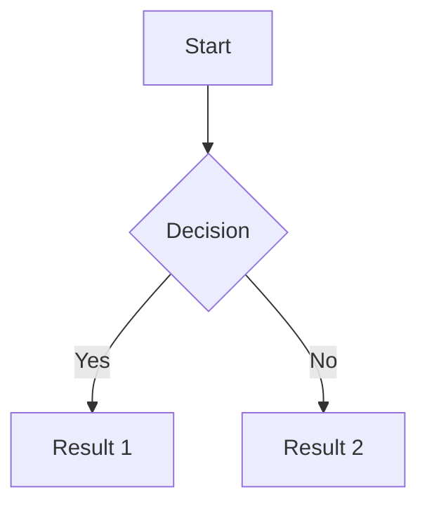
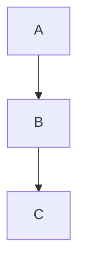

# Customize

Reference for working with this site. All changes go on the `main` branch — there is no `gh-pages` branch to worry about.

## Project structure

Only the directories/files that matter for content or styling:

```
.
├── _config.yml          ← main configuration
├── _data/
│   └── socials.yml      ← social links (email, github, linkedin)
├── _includes/           ← Liquid partials included in layouts
│   ├── head.liquid
│   ├── header.liquid
│   ├── footer.liquid (via default layout)
│   ├── figure.liquid
│   ├── metadata.liquid
│   ├── pagination.liquid
│   ├── scripts.liquid
│   └── distill_scripts.liquid
├── _layouts/
│   ├── about.liquid     ← home page layout
│   ├── archive.liquid   ← blog archive pages
│   ├── default.liquid   ← base layout
│   ├── page.liquid      ← generic page
│   └── post.liquid      ← blog post
├── _pages/
│   ├── about.md         ← home page content
│   ├── blog.md          ← blog listing page
│   └── 404.md
├── _posts/              ← blog posts (YYYY-MM-DD-title.md)
├── _sass/               ← stylesheets
│   ├── _variables.scss  ← color/size variables
│   ├── _themes.scss     ← theme color definitions
│   ├── _typography.scss ← fonts, headings, links
│   ├── _layout.scss     ← page layout
│   ├── _navbar.scss     ← navigation bar
│   ├── _blog.scss       ← blog listing styles
│   ├── _components.scss ← cards, profile, etc.
│   ├── _custom.scss     ← custom overrides (add site-specific styles here)
│   └── _utilities.scss  ← code highlighting, animations
└── assets/
    ├── img/             ← images (profile pic lives here as prof_pic.jpg)
    ├── css/
    ├── js/
    └── fonts/
```

## Configuration (`_config.yml`)

Key settings and their current values:

### Site identity
```yaml
first_name: Akaash
last_name: Dash
url: https://akaashdash.github.io
baseurl:            # empty — leave it empty, do not delete the key
description: >
  Personal website of Akaash Dash, quantitative researcher and software engineer.
keywords: quantitative finance, software engineering, georgia tech  # injected as <meta> tags
lang: en
```

### Layout
```yaml
navbar_fixed: true
footer_fixed: true
max_width: 800px    # main content max width
back_to_top: true
```

### Features currently DISABLED
```yaml
enable_darkmode: false       # no dark mode toggle
search_enabled: false        # no search bar
enable_navbar_social: false  # social icons not shown in navbar
enable_cookie_consent: false # no GDPR cookie dialog
enable_google_analytics: false
serve_og_meta: false         # no Open Graph tags
serve_schema_org: false
```

### Features currently ENABLED
```yaml
enable_math: true            # MathJax for LaTeX in posts
enable_masonry: true
enable_medium_zoom: true     # click-to-zoom on images
enable_progressbar: true     # scroll progress bar
enable_project_categories: true
lazy_loading_images: true
imagemagick:
  enabled: true              # generates WebP versions of images in assets/img/
```

### Blog
```yaml
permalink: /blog/:year/:title/
pagination:
  enabled: true
related_blog_posts:
  enabled: true
  max_related: 5
lsi: false
giscus:              # comments — not configured, fields left empty
  repo:
  repo_id:
```

### Scholar (BibTeX) — configured but no `_bibliography/` folder exists
The scholar config block is present in `_config.yml` but there is no `_bibliography/papers.bib` file. To add publications: create `_bibliography/papers.bib` and a publications page.

## About page (`_pages/about.md`)

Frontmatter controls layout:

```yaml
---
layout: about
title: about
permalink: /
profile:
  align: left          # profile pic alignment: left or right
  image: prof_pic.jpg  # file in assets/img/
  image_circular: false

selected_papers: false  # requires _bibliography/papers.bib
social: true            # shows icons from _data/socials.yml

announcements:
  enabled: false        # requires _news/ directory

latest_posts:
  enabled: false        # shows recent posts on home page
  scrollable: true
  limit: 3
---
```

The about layout (`_layouts/about.liquid`) only renders social icons for `email`, `github_username`, and `linkedin_username`. It does not use the full jekyll-socials plugin output — it's a simplified custom implementation.

## Social links (`_data/socials.yml`)

```yaml
email: akaash.dash@gmail.com
github_username: akaashdash
linkedin_username: akaash-dash
```

To add more social icons, you'd also need to update `_layouts/about.liquid` since it explicitly checks for only these three fields.

## Blog posts (`_posts/`)

Filename format: `YYYY-MM-DD-title.md`

Minimal frontmatter:
```yaml
---
layout: post
title: Post Title
date: 2024-01-15
description: Short description shown in listing
tags: tag1 tag2
categories: category
---
```

Optional frontmatter fields:
- `description: "..."` — shown in the blog listing and in search engine result snippets (aim for 120–160 chars)
- `featured: true` — pins post to top of blog listing with a card
- `thumbnail: assets/img/foo.jpg` — shows image in listing
- `related_posts: false` — disables related posts for this post
- `toc: true` — inline table of contents generated from headings
- `toc_sidebar: true` — TOC in a floating sidebar instead of inline
- `math: true` — enables MathJax for this post (already on globally via `enable_math: true`)
- `pseudocode: true` — enables pseudocode.js rendering
- `code_diff: true` — enables diff2html enhanced diff blocks
- `map: true` — enables Leaflet for GeoJSON maps
- `chart: true` — enables Chart.js
- `vega_lite: true` — enables Vega-Lite
- `images.lightbox2: true` — enables Lightbox2 photo gallery
- `images.photoswipe: true` — enables PhotoSwipe gallery
- `images.spotlight: true` — enables Spotlight.js gallery
- `images.venobox: true` — enables VenoBox gallery
- `og_image: /assets/img/foo.png` — custom Open Graph preview image for this post (when `serve_og_meta: true`)

**Redirect posts** — a post that links to an external URL instead of its own page:
```yaml
---
layout: post
title: My Article on Medium
redirect: https://medium.com/@akaashdash/my-article
date: 2024-06-01
description: Written for Medium
---
```
The blog listing shows an external-link icon and opens the URL in a new tab. The `_pages/blog.md` template already handles this.

**External source posts** (pull in from an RSS feed):
```yaml
external_sources:
  - name: Medium
    rss_url: https://medium.com/@akaashdash/feed
```
These appear in the blog listing alongside local posts.

Draft posts go in `_drafts/` (not built by default).

Scheduled posts: rename `.github/workflows/schedule-posts.txt` to `.yml` and put dated posts in `_scheduled/`.

## Post content features

All of these work in `_posts/` files. The gems and JS libraries are already in `Gemfile` and `_config.yml`.

### Images

**Single figure with caption:**
```liquid

```

**Responsive image grid (Bootstrap):**
```html
<div class="row mt-3">
  <div class="col-sm mt-3 mt-md-0">
    
  </div>
  <div class="col-sm mt-3 mt-md-0">
    
  </div>
</div>
<div class="caption">Caption that applies to both images above.</div>
```
Use `col-sm` for 2 columns, add more `col-sm` divs for 3+. `zoomable=true` enables medium-zoom click-to-expand.

**Image carousel (Swiper):**
```html
<swiper-container keyboard="true" navigation="true" pagination="true" pagination-clickable="true" autoplay-delay="2000">
  <swiper-slide></swiper-slide>
  <swiper-slide></swiper-slide>
</swiper-container>
```

**Before/after image comparison slider:**
```html

  
  
</img-comparison-slider>
```

**Photo galleries** (add the relevant key under `images:` in frontmatter):

Lightbox2:
```html
<a href="assets/img/large.jpg" data-lightbox="gallery-name" data-title="Caption">
  
</a>
```

PhotoSwipe (add `images.photoswipe: true`):
```html
<div id="my-gallery" class="pswp-gallery">
  <a href="assets/img/large.jpg" data-pswp-width="2500" data-pswp-height="1667">
    
  </a>
</div>
```

### Video

```liquid



```

### Audio

```liquid

```

### Math (LaTeX)

Globally enabled via `enable_math: true`. Inline: `$E = mc^2$`. Display: `$$\int_0^\infty f(x)\,dx$$`.

### Code

Standard fenced code blocks with syntax highlighting. For enhanced diff display, add `code_diff: true` to frontmatter:

````
```diff2html
--- a/file.js
+++ b/file.js
@@ -1 +1 @@
-old line
+new line
```
````

### Mermaid diagrams

````

````

### TikZ figures

Add `tikzjax: true` to frontmatter, then use `<script type="text/tikz">` blocks.

### Pseudocode

Add `pseudocode: true` to frontmatter:

```html
<pre class="pseudocode" id="my-algorithm">
\begin{algorithm}
\caption{QuickSort}
\begin{algorithmic}
\PROCEDURE{QuickSort}{$$A, p, r$$}
  \IF{$$p < r$$}
    \STATE $$q$$ = \CALL{Partition}{$$A, p, r$$}
    \STATE \CALL{QuickSort}{$$A, p, q - 1$$}
  \ENDIF
\ENDPROCEDURE
\end{algorithmic}
\end{algorithm}
</pre>
```
Note: use `$$` instead of `$` for math expressions inside pseudocode blocks.

### Typograms (ASCII diagrams)

````
```typogram
+----+
|    |---> Label
+----+
```
````

### Custom blockquotes

```markdown
> ##### TIP
>
> Tip content here.
{: .block-tip }

> ##### WARNING
>
> Warning content here.
{: .block-warning }

> ##### DANGER
>
> Danger content here.
{: .block-danger }
```

### Bootstrap tables (data from JSON)

Add `tables: true` (or it's auto-loaded) and create a JSON file at `assets/json/table_data.json`:

```html
<table data-toggle="table" data-url="{{ '/assets/json/table_data.json' | relative_url }}"
       data-pagination="true" data-search="true">
  <thead>
    <tr>
      <th data-field="id" data-sortable="true">ID</th>
      <th data-field="name" data-sortable="true">Name</th>
    </tr>
  </thead>
</table>
```

### GeoJSON maps (Leaflet)

Add `map: true` to frontmatter:

````
```geojson
{
  "type": "FeatureCollection",
  "features": [{
    "type": "Feature",
    "geometry": { "type": "Point", "coordinates": [-84.39, 33.77] }
  }]
}
```
````

Design your GeoJSON at https://geojson.io.

### Data visualization charts

**Chart.js** (add `chart: true` to frontmatter or it auto-detects):
````
```chartjs
{
  "type": "bar",
  "data": { "labels": ["A","B","C"], "datasets": [{"data": [1,2,3]}] }
}
```
````

**ECharts** (add `echarts: true`):
````
```echarts
{ "xAxis": {"data": ["A","B"]}, "yAxis": {}, "series": [{"type":"bar","data":[1,2]}] }
```
````

**Vega-Lite** (add `vega_lite: true`):
````
```vega_lite
{
  "$schema": "https://vega.github.io/schema/vega-lite/v5.json",
  "mark": "bar",
  "data": {"values": [...]},
  "encoding": { "x": {"field": "a"}, "y": {"field": "b"} }
}
```
````

**Plotly** (add `plotly: true`):
````
```plotly
{ "data": [{"type": "scatter", "x": [1,2,3], "y": [4,5,6]}] }
```
````

### In-post citations (requires publications setup)

With `jekyll-scholar` active and `_bibliography/papers.bib` present:

```liquid
                      <!-- inline citation -->
         <!-- multiple citations -->
                 <!-- full reference -->
Quoted text.  <!-- attributed blockquote -->

                   <!-- reference list for this post -->
```

### Twitter/X embeds

```liquid

```

## Styling

### Theme color
Edit `_sass/_themes.scss` — change the `--global-theme-color` CSS variable. Stock color options (names) are in `_sass/_variables.scss`.

### Fonts, spacing, layout
- `_sass/_typography.scss` — fonts, heading styles, link styles, tables, blockquotes
- `_sass/_layout.scss` — page layout (content width overridden by `max_width` in `_config.yml`)
- `_sass/_navbar.scss` — navigation bar styles
- `_sass/_custom.scss` — add site-specific overrides here to avoid touching upstream files

### Per-post styles
Add a `_styles` key to post frontmatter:
```yaml
_styles: >
  .post-content h2 { font-size: 1.5rem; }
```

## Navigation

The navbar is built from pages with `nav: true` in their frontmatter. Current nav pages:

- `_pages/blog.md` — `nav: true`, `nav_order: 1`

To add a page to the nav, set `nav: true` and `nav_order: N` in the page's frontmatter.

## Images

Profile picture: `assets/img/prof_pic.jpg`

ImageMagick is enabled and generates WebP versions automatically during build for files in `assets/img/`. Supported input formats: `.jpg`, `.jpeg`, `.png`, `.tiff`, `.gif`.

For images in posts, see [Post content features → Images](#images-1) for grids, carousels, comparison sliders, and galleries. Basic usage:
```liquid

```
Or standard Markdown: ``

## Latent features

These features are **available in this repo** — the gems, config keys, and SCSS are all present — but are either disabled via `_config.yml` flags or require a small amount of content/setup to activate. They were part of al-folio and were intentionally stripped down to keep the site minimal, but can be turned back on without major work.

### One-line toggles (flip a flag in `_config.yml`)

| Feature | Config key | Notes |
|---------|-----------|-------|
| Dark mode | `enable_darkmode: true` | Sun/moon toggle in navbar; SCSS and JS already present |
| Search | `search_enabled: true` | Full-text search across pages and posts |
| Navbar social icons | `enable_navbar_social: true` | Shows social icons in the top nav |
| Image zoom (medium-style) | `enable_medium_zoom: true` | Already `true` — click images to zoom |
| Math (MathJax) | `enable_math: true` | Already `true` — LaTeX in posts |
| Scroll progress bar | `enable_progressbar: true` | Already `true` |
| Tooltips on section headings | `enable_tooltips: true` | Generates anchor tooltip links |
| Video embedding in bib entries | `enable_video_embedding: true` | Opens videos inline instead of new tab |
| Open Graph meta tags | `serve_og_meta: true` | Rich social media previews when sharing links |
| Schema.org markup | `serve_schema_org: true` | Structured data for search engines |
| GDPR cookie consent dialog | `enable_cookie_consent: true` | Required if you add analytics and have EU visitors |
| Back to top button | `back_to_top: true` | Already `true` |

### Comments (Giscus)

The template is wired up — just needs the repo IDs filled in:

1. Go to https://giscus.app, configure for `akaashdash/akaashdash.github.io`
2. Enable Discussions on the repo (Settings → Features)
3. Fill in `_config.yml`:
   ```yaml
   giscus:
     repo: akaashdash/akaashdash.github.io
     repo_id: <from giscus.app>
     category: Comments
     category_id: <from giscus.app>
   ```

### Analytics

Four providers are wired up in `_config.yml`, all disabled. Set the flag and add your ID:

```yaml
# Google Analytics GA4 — ID format: G-XXXXXXXXXX
enable_google_analytics: true
google_analytics: G-XXXXXXXXXX

# Pirsch — ID format: 32 characters. GDPR-compliant, no cookie consent needed.
enable_pirsch_analytics: true
pirsch_analytics: YOUR_32_CHAR_SITE_ID

# Openpanel — ID format: UUID. Open-source, privacy-focused.
enable_openpanel_analytics: true
openpanel_analytics: YOUR-UUID-HERE

# Cronitor — uptime monitoring + RUM. Paid.
enable_cronitor_analytics: true
cronitor_analytics: YOUR_SITE_ID
```

If using Google Analytics or Cronitor, also set `enable_cookie_consent: true` for GDPR compliance. **Note:** `_scripts/cookie-consent-setup.js` was removed from this repo — restore it from upstream before enabling: https://github.com/alshedivat/al-folio/blob/main/_scripts/cookie-consent-setup.js

### Search engine verification

Verify site ownership with Google/Bing search consoles:

```yaml
google_site_verification: YOUR_GOOGLE_VERIFICATION_CODE
enable_google_verification: true

bing_site_verification: YOUR_BING_CODE
enable_bing_verification: true
```

Get verification codes from https://search.google.com/search-console and https://www.bing.com/webmasters.

### Auto-generated site infrastructure

These work automatically with no config:

- **Sitemap**: `/sitemap.xml` — generated by `jekyll-sitemap` (Gemfile)
- **RSS feed**: `/feed.xml` — generated by `jekyll-feed` (Gemfile); requires `title`, `description`, and `url` set in `_config.yml`
- **robots.txt**: present in repo root
- **External links**: `jekyll-link-attributes` automatically adds `rel="nofollow noopener"` and `target="_blank"` to all external links
- **WebP images**: `jekyll-imagemagick` generates responsive WebP versions of all images in `assets/img/` at build time

### Newsletter (Loops.so)

```yaml
newsletter:
  enabled: true
  endpoint: https://app.loops.so/api/newsletter-form/YOUR-ENDPOINT
```

A signup form appears at the bottom of the about page and blog posts.

### External blog post sources

Pull in posts from Medium or other RSS feeds:

```yaml
external_sources:
  - name: Medium
    rss_url: https://medium.com/@your-handle/feed
```

### Post scheduling

Rename `.github/workflows/schedule-posts.txt` to `schedule-posts.yml`. Then put dated posts in `_scheduled/` (format: `YYYY-MM-DD-title.md`). They auto-publish at 23:30 UTC on their scheduled date.

### Tabs in posts/pages

The `jekyll-tabs` gem is installed. Use in any Markdown file:

```liquid


Content for tab one.


Content for tab two.


```

### Table of contents

The `jekyll-toc` gem is installed. Add `toc: true` to a post's frontmatter and a TOC is auto-generated from headings.

### Jupyter notebooks

The `jekyll-jupyter-notebook` gem is installed. Place `.ipynb` files in the repo and include them in a post:

```yaml
---
layout: post
jupyter: path/to/notebook.ipynb
---
```

### Emoji shortcodes

`jemoji` is installed. Use `:emoji_name:` shortcodes in any Markdown file. Example: `:rocket:` → 🚀

### Twitter/X embeds

`jekyll-twitter-plugin` is installed. In any Markdown:

```liquid

```

### Mermaid diagrams

Available via CDN (configured in `third_party_libraries` in `_config.yml`). In any post:

````markdown

````

### Chart.js charts

Available via CDN. Use in posts with an HTML canvas block and the chart initialization script.

### Collections (books, news, projects, teachings)

`_config.yml` already defines these four collections. To activate any of them:

1. Create the directory (`_books/`, `_news/`, `_projects/`, or `_teachings/`)
2. Add Markdown files with appropriate frontmatter
3. Create a `_pages/` file to display the collection (copy the pattern from upstream al-folio)
4. Add `nav: true` and a `nav_order` to the page

**News/announcements**: Show on the about page — set `announcements: enabled: true` in `_pages/about.md` frontmatter, then add `.md` files to `_news/`.

**Latest posts on home page**: Set `latest_posts: enabled: true` in `_pages/about.md` frontmatter.

### Distill-style blog posts

The upstream al-folio `distill` layout (`_layouts/distill.liquid`) was removed from this repo. To restore it, copy from https://github.com/alshedivat/al-folio/blob/main/_layouts/distill.liquid. Distill posts support `<d-cite>`, `<d-footnote>`, `<d-math>`, and other custom tags.

### Publications page

The `jekyll-scholar` gem is in the Gemfile. The scholar config in `_config.yml` is already set up (`last_name: [Dash]`, `first_name: [Akaash, A.]`). To restore:

1. Create `_bibliography/papers.bib`
2. Copy `_layouts/bib.liquid` from upstream
3. Create `_pages/publications.md` with `layout: bib`

BibTeX fields supported: `abstract`, `arxiv`, `pdf`, `code`, `slides`, `poster`, `video`, `website`, `blog`, `html`, `bibtex_show`, `altmetric`, `dimensions`, `google_scholar_id`, `selected`.

### CV page

Copy `_pages/cv.md` and `_layouts/cv.liquid` from upstream. CV data goes in `assets/json/resume.json` (JSONResume format) or `_data/cv.yml` (RenderCV format).

### Projects page

1. Create `_projects/` directory with `.md` files
2. Copy `_pages/projects.md` from upstream
3. Optional: restore `_includes/projects.liquid` and `_includes/projects_horizontal.liquid`

### Repository stats page

Shows GitHub repo cards and profile trophies. Needs `_data/repositories.yml` (list of repos to display) and `_pages/repositories.md` from upstream. The external service URLs are already configured in `_config.yml`:

```yaml
external_services:
  github_readme_stats_url: https://github-readme-stats.vercel.app
  github_profile_trophy_url: https://github-profile-trophy.vercel.app
```

### Google Calendar embed

Include a Google Calendar on any page:

```liquid

```

Add `calendar: true` to the page's frontmatter.

### People page

Shows multiple people with bios and photos (useful if the site grows). Copy `_pages/people.md` and related includes from upstream.

### Co-author links in publications

When publications are active, `_data/coauthors.yml` can map co-author last names to their websites so their names auto-link in the bibliography.

---

## What was removed from al-folio

These things were physically deleted (not just disabled) and would need to be pulled from upstream to restore:

| Feature | What to restore |
|---------|----------------|
| Publications page | `_layouts/bib.liquid`, `_pages/publications.md`, and create `_bibliography/papers.bib` |
| Projects page | `_pages/projects.md`, optionally `_includes/projects.liquid` |
| CV page | `_layouts/cv.liquid`, `_pages/cv.md` |
| Teaching page | `_layouts/course.liquid` (if using course layout), `_pages/teachings.md` |
| Repository stats page | `_pages/repositories.md`, `_includes/repository/` directory |
| Distill post layout | `_layouts/distill.liquid`, `_includes/distill_scripts.liquid` |
| Scholar plugins | `_plugins/google-scholar-citations.rb`, `_plugins/hide-custom-bibtex.rb`, `_plugins/inspirehep-citations.rb` |
| External post fetcher | `_plugins/external-posts.rb` |
| Cookie consent script | `_scripts/cookie-consent-setup.js` |

Everything else (gems, config keys, SCSS, JS libraries) is still present.

## Technology stack

- **Jekyll 4.x** — static site generator
- **Ruby / Bundler** — dependency management (`Gemfile`)
- **Liquid** — templating language for layouts and includes
- **SCSS** — stylesheets compiled by Jekyll (`_sass/`)
- **Bootstrap 4.6** — responsive grid and base components
- **MathJax 3.2** — LaTeX math rendering (globally enabled)
- **GitHub Actions** — CI/CD for build and deploy
- **GitHub Pages** — hosting (Pages artifact API, not `gh-pages` branch)
